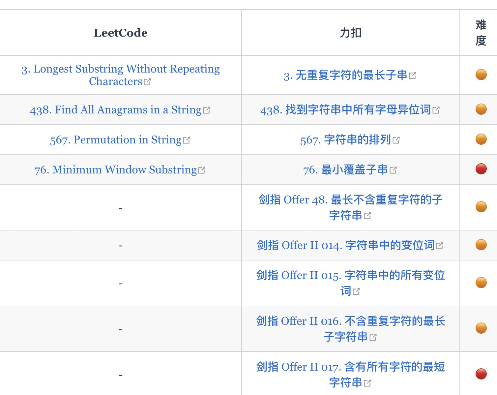

# 今日刷题：

[3. 无重复字符的最长子串](https://leetcode.cn/problems/longest-substring-without-repeating-characters/)

python版本

```python
class Solution:
    def lengthOfLongestSubstring(self, s: str) -> int:
        left, right, res = 0, 0, 0
        windows = {}
        while right < len(s):
            r_value = s[right]
            right += 1
            windows[r_value] = windows.get(r_value, 0) + 1

            while windows[r_value] > 1:
                l_value = s[left]
                left += 1
                windows[l_value] -= 1
            
            res = max(res, right - left)
        return res
```

go版本

```go

```


# 总结

这题考查的是滑动窗口

https://labuladong.online/algo/essential-technique/sliding-window-framework/

以下都是滑动窗口题目：

